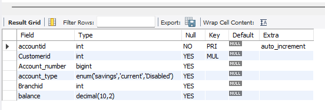
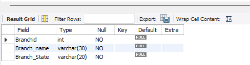
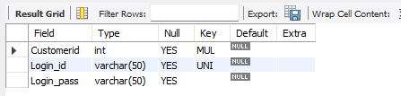
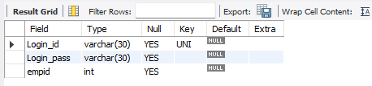
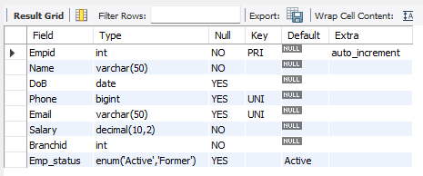
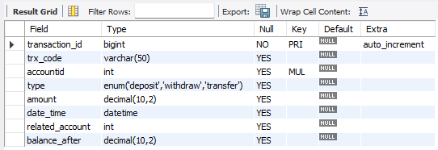

## 🗄️ Database Structure

### 📌 Database Name
**Bankdb**

### 📊 Total Number of Tables
**7 Tables**

---

## 📂 Tables in Database

Below are the tables used in the system along with their schema.

---

### 🧾 Accounts Table
Stores customer account information.

---

### 🏢 Branches Table
Stores bank branch details.

---

### 🔐 CustomerLogDetails Table
Stores customer login credentials and authentication details.

---

### 👤 Customers Table
Stores personal and account-related customer information.

---

### 🔐 EmpLogDetails Table
Stores employee login credentials and authentication details.

---

### 🧑‍💼 Employee Table
Stores employee details and role-related information.

---

### 💳 Transactions Table
Stores transaction records such as deposits, withdrawals, and transfers.

